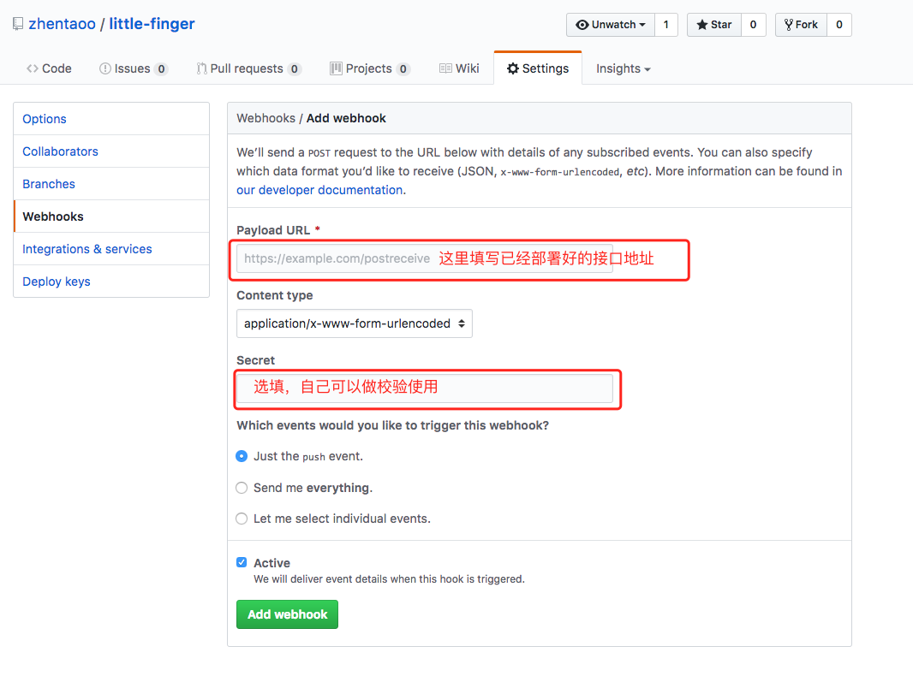
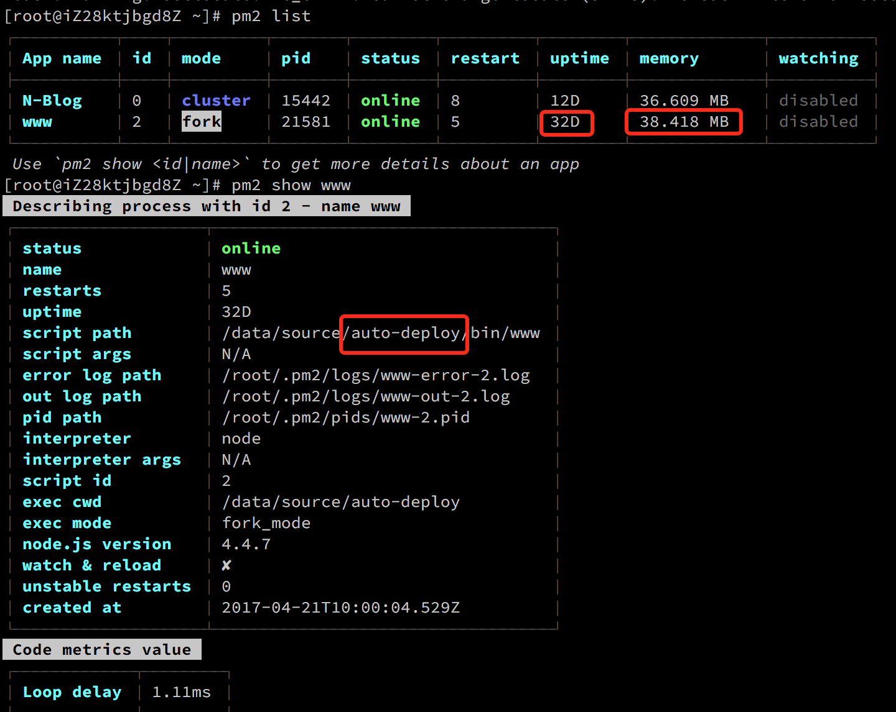

## Little-Finger 前端自动部署工具

### Usage
1. git clone https://github.com/zhentaoo/little-finger
2. npm install
3. npm start(如果在服务器上部署推荐使用pm2，pm2 start bin/www)
4. 如果有
5. 如果有一个需要自动部署的项目，则在github配置对应的webhook（当该项目有新的commit时向little-finger发一个请求）
6. 在little-finger中添加一条路由,类似router.post('/js-tower', cb)

### 设计思路
1. 要知道github（gitlab）的repo是可以设置**webhook**的，如果repo有了新的commit，则会触发webhook
2. 利用这个hook，请求自己事先部署好的server
3. 当这个server收到hook，则执行git pull命令，拉取对应repo的最新代码

### Feature
1. 定义发布的多个阶段
2. 一套完整的UI
3. 完善的权限系统
4. 回滚策略，构建失败时的补偿策略

### Demo
看一下这个node server 稳定运行32天，仅仅占用不到40M的内存！！！

